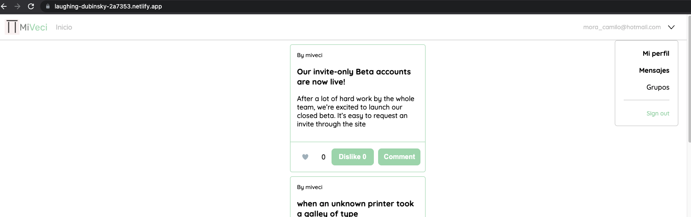

# miveciclient
Cliente Socila media aplicación React 

# Setup
1. Instalar de las dependencias
2. ejecutar el comando npm run start

## Construido con:
- [React]
- [Hooks]

## Diseño UI
Todos los diseños son propios, la fuente es de google Fonts Quicksand

## Demo

